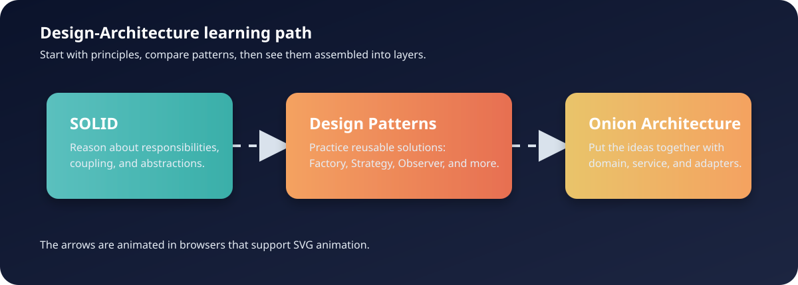

Design Architecture: Python and Java Learning Repository
========================================================

A practical software-design study repository containing runnable Python and Java
examples for SOLID principles, design patterns, architectural patterns, and
low-level design (LLD) systems.

The code is intentionally educational. Most files are self-contained demos that
let you read a direct implementation, compare an abstraction-based version, and
then modify the example yourself.

.. contents:: Contents
   :depth: 2
   :local:

Learning path
-------------

Use this order when starting from a fresh clone:

#. Learn the vocabulary in ``solid_principles/``.
#. Study the small examples in ``design_patterns/``.
#. Read ``architectural_patterns/onion_architecture/onion.py`` to see
   dependency inversion and layered boundaries in one application.
#. Practice larger systems in ``LLD_Interview_Questions/``.
#. Use the SVG diagrams in ``docs/`` as a quick map of the repository.

The central idea is::

   principles -> patterns -> architecture -> low-level system design

Repository map
--------------

::

   Design-Architecture/
   +-- README.rst
   +-- LICENSE
   +-- .gitignore
   +-- docs/
   |   +-- architecture-flow.svg
   |   +-- architecture-learning-map.svg
   +-- design_patterns/
   |   +-- README.rst
   |   +-- creational/
   |   |   +-- abstract_factory/
   |   |   +-- builder/
   |   |   +-- factory_method/
   |   |   +-- prototype/
   |   |   +-- singleton/
   |   +-- structural/
   |   |   +-- adapter/
   |   |   +-- proxy/
   |   +-- behavioral/
   |       +-- iterator/
   |       +-- memento/
   |       +-- observer/
   |       +-- strategy/
   |       +-- template_method/
   +-- solid_principles/
   |   +-- SOLID_principles.ipynb
   |   +-- SOLID.java
   |   +-- Solid_OCP.java
   |   +-- SolidPrinciples_SRP_code.java
   +-- architectural_patterns/
   |   +-- onion_architecture/onion.py
   +-- LLD_Interview_Questions/
       +-- 34 Java system-design exercises

The requested future pattern directories also exist as learning-map locations.
Git does not track empty directories, so an empty location appears after cloning
only when it later receives a file or a ``.gitkeep`` placeholder.

Prerequisites
-------------

Python track:

* Python 3.9 or newer. Python 3.9+ is needed for annotations such as
  ``list[Course]`` in the Onion example.
* No third-party Python runtime packages are required for the scripts.
* Jupyter Notebook or JupyterLab is optional for the SOLID notebook.

Java track:

* JDK 11 or newer is recommended.
* The repository does not use Maven or Gradle; the Java examples use the JDK
  compiler and standard library.
* Some filenames preserve their original learning-example names and may not
  match the public Java class name exactly. Compile those files individually
  after checking the public class declaration.

General tools:

* Git
* A terminal
* A text editor or IDE
* VS Code is optional, with Python, Java, and Jupyter extensions useful but not
  required.

Setup
-----

Windows PowerShell::

   git clone https://github.com/rahmanashis/Design-Architecture.git
   cd Design-Architecture
   py -3 -m venv .venv
   .venv\\Scripts\\Activate.ps1
   python --version

Windows Git Bash::

   git clone https://github.com/rahmanashis/Design-Architecture.git
   cd Design-Architecture
   python -m venv .venv
   source .venv/Scripts/activate
   python --version

macOS or Linux::

   git clone https://github.com/rahmanashis/Design-Architecture.git
   cd Design-Architecture
   python3 -m venv .venv
   source .venv/bin/activate
   python --version

The Python scripts require no ``pip install`` step. To open the notebook::

   python -m pip install jupyter
   jupyter notebook solid_principles/SOLID_principals.ipynb

Run the Python examples
-----------------------

Representative commands from the repository root::

   python design_patterns/creational/abstract_factory/AbstractFactory.py
   python design_patterns/creational/factory_method/Factory_1.py
   python design_patterns/behavioral/iterator/iterator.py
   python design_patterns/behavioral/memento/memento.py
   python design_patterns/behavioral/observer/Observer.py
   python design_patterns/behavioral/strategy/strategy.py
   python design_patterns/behavioral/template_method/template.py
   python architectural_patterns/onion_architecture/onion.py

The Abstract Factory and Strategy examples use ``input()``. Enter values such
as ``email``, ``sms``, or ``push`` when prompted.

The Onion example uses an in-memory database. It demonstrates entities,
repository interfaces, concrete repositories, services, controllers, duplicate
student validation, and dependency injection without requiring a real database.

Run Java examples
-----------------

Compile one self-contained demo into a temporary directory::

   mkdir -p .java-build
   javac -d .java-build design_patterns/creational/builder/BuilderExample2.java
   java -cp .java-build BuilderExample2

On Windows PowerShell, use ``New-Item -ItemType Directory .java-build`` instead
of ``mkdir -p``. The ``.gitignore`` file excludes common build output.

For an LLD demo, use the same pattern after checking its public class name::

   javac -d .java-build LLD_Interview_Questions/ElevatorSystem.java
   java -cp .java-build ElevatorSystem

Some LLD files are intentionally alternate versions of the same system. The
extensionless ``LLD_Interview_Questions/PaymentGatewayLLD`` file is kept as
learning material, while ``PaymentGatewayLLD.java`` is the normal Java source
entry point.

SOLID principles
----------------

The ``solid_principles/`` directory contains:

* ``SOLID_principles.ipynb``: guided Markdown and Python cells for SRP, OCP,
  and LSP, followed by summaries of ISP and DIP.
* ``SOLID.java``: a combined teaching demo covering responsibility, extension,
  substitution, interface segregation, and dependency inversion.
* ``SolidPrinciples_SRP_code.java``: a focused Single Responsibility example.
* ``Solid_OCP.java``: payment-method polymorphism for the Open-Closed Principle.

Read the notebook first if the principles are new. Then compare the Java files
with the Python examples in the design-pattern directories.

Design patterns
---------------

The complete pattern guide is in ``design_patterns/README.rst``. The categories
currently contain these examples:

Creational:

* Abstract Factory: related product families such as payment gateways, UI
  controls, and message senders.
* Builder: readable construction of complex user and food-order objects.
* Factory Method: creation of notification implementations through factories.
* Prototype: object copying and a performance-oriented Java demonstration.
* Singleton: shared-instance examples, including a deliberately broken
  concurrent version for comparison.

Structural:

* Adapter: converting incompatible payment interfaces.
* Proxy: protecting or controlling access to a user repository.

Behavioral:

* Iterator: playlist traversal with and without an iterator abstraction.
* Memento: text-editor state capture and restoration.
* Observer: weather and stock updates sent to multiple observers.
* Strategy: interchangeable discount and payment strategies.
* Template Method: shared file-parsing algorithm steps with customizable
  parsing behavior.

The root-level payment and snake-and-ladder examples remain under
``design_patterns/`` because they are useful demos but are not assigned to a
single GoF category.

Architectural patterns
----------------------

``architectural_patterns/onion_architecture/onion.py`` is a complete,
self-contained Onion Architecture demonstration:

* Domain entities: ``Student``, ``Course``, and ``Trainer``.
* Abstractions: repository and service interfaces.
* Infrastructure: in-memory database and concrete repositories.
* Application services: business operations and duplicate-ID validation.
* Presentation: controllers that delegate to services.
* Composition root: dependency wiring in the main block.

The dependency direction points inward::

   Controller -> Service interface -> Repository interface
                                      ^
                                      |
                         concrete in-memory repository

Low-level design interview systems
----------------------------------

``LLD_Interview_Questions/`` contains 34 Java exercises. They are grouped by
the system they model rather than by file order:

* Elevator: basic, advanced, concurrent, class-based, and LLD versions.
* Vending machine: basic, advanced, state-based, and demo versions.
* Logger: simple, configurable, file/console, and asynchronous versions.
* Parking lot: basic, advanced, class-based, and pricing-strategy versions.
* Payment gateway: mid-level, repository-based, and locking versions.
* Pub/Sub: basic broker, decorator-based retry, and dead-letter-queue version.
* URL shortener: simple, Base62, hashing, repository, and observer variants.
* Notification system: basic and preference-aware asynchronous versions.
* Load balancer: basic and class-oriented examples.
* Movie booking, optimistic locking, and ride booking standalone systems.

Recommended LLD study loop:

#. Choose one system and read the simplest filename first.
#. Identify entities, services, repositories, interfaces, and state transitions.
#. Compare the basic and advanced versions where both exist.
#. Compile and run the smallest self-contained Java file.
#. Add one feature, such as another payment method, vehicle type, or observer.
#. Record which abstraction changed and which client code stayed unchanged.

No database, web server, or external service is required for the examples. Most
systems use in-memory collections and simulated providers.

How to learn effectively
------------------------

For every example:

#. Read the code before running it.
#. Run the smallest version and observe the output.
#. Find the class that owns the main responsibility.
#. Trace dependencies from the entry point to the business logic.
#. Compare the direct version with the abstraction-based version.
#. Make one small change and run it again.
#. Note both the benefit and the cost of the added abstraction.

What this repository is not
---------------------------

* It is not a production framework or packaged library.
* It does not provide deployment configuration, a web API, or persistent data.
* It does not yet contain a complete automated test suite.
* The examples favor clarity and comparison over exhaustive validation.

Common questions
----------------

Do I need every design pattern before studying LLD?
~~~~~~~~~~~~~~~~~~~~~~~~~~~~~~~~~~~~~~~~~~~~~~~~~~~
No. Learn SOLID first, then study the pattern relevant to the system you want to
build. For a vending machine, start with State and Factory ideas. For payments,
start with Strategy, Factory, and repository abstractions. For notifications,
start with Observer and Strategy.

Why are some pattern directories empty?
~~~~~~~~~~~~~~~~~~~~~~~~~~~~~~~~~~~~~~~
They are reserved learning locations. Git does not version empty directories;
add a real example or a ``.gitkeep`` file when a location needs to persist.

Why are some filenames inconsistent?
~~~~~~~~~~~~~~~~~~~~~~~~~~~~~~~~~~~~
The repository contains classroom examples created at different times. Their
paths and names are preserved to avoid silently changing source files. Use the
README paths exactly when running them.

Where should a new example go?
~~~~~~~~~~~~~~~~~~~~~~~~~~~~~~
Put it in the matching design-pattern category, SOLID directory, architectural
pattern directory, or LLD collection. Add a focused README note when the new
example introduces a new learning path.

Contribution checklist
----------------------

Before committing changes:

* Keep one design idea per example.
* Preserve comparison files such as ``without_*`` where useful.
* Run changed Python files and compile changed Java files.
* Validate notebook JSON after notebook edits.
* Keep build output, virtual environments, caches, and secrets ignored.
* Update both this root guide and the focused design-pattern guide when paths
  or learning order changes.

License
-------

See ``LICENSE`` for the repository license terms.
