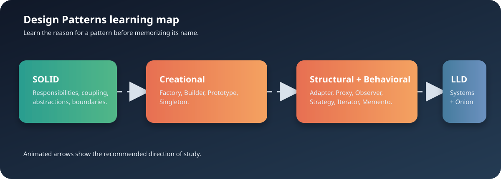

Design Patterns Learning Guide
==============================

This directory is the pattern-focused part of the repository. It contains small
Python and Java examples organized by the Gang of Four pattern families:
creational, structural, and behavioral.

The examples are study material, not a production framework. Read the paired
``without_*`` examples first where available, then compare the pattern version.
The goal is to understand the design pressure that makes a pattern useful.

Learning map
------------

::

   SOLID principles
          |
          v
   Creational patterns ---> Structural patterns ---> Behavioral patterns
          |                         |                       |
          +-------------------------+-----------------------+
                                    |
                                    v
                 Apply the ideas in Onion Architecture

Recommended order
~~~~~~~~~~~~~~~~~

#. Read ``../solid_principles/SOLID_principals.ipynb``. Start with SRP, OCP,
   LSP, ISP, and DIP.
#. Begin with ``creational`` patterns because they explain object creation and
   reduce direct coupling to concrete classes.
#. Continue with ``structural`` patterns to study composition and adapters.
#. Finish with ``behavioral`` patterns to study communication, traversal, and
   interchangeable behavior.
#. Read ``../architectural_patterns/onion_architecture/onion.py`` to see
   dependency inversion, services, repositories, and controllers working
   together.
#. Review the examples in ``../LLD_Interview_Questions/`` after the patterns.
   Those larger Java exercises combine multiple design ideas in systems such
   as elevators, parking lots, payments, vending machines, loggers, and URL
   shorteners.

Repository structure
--------------------

::

   design_patterns/
   +-- README.rst
   +-- architecture-learning-map.svg
   +-- creational/
   |   +-- factory_method/
   |   +-- abstract_factory/
   |   +-- builder/
   |   +-- prototype/
   |   +-- singleton/
   +-- structural/
   |   +-- adapter/
   |   +-- bridge/                 # reserved for a future example
   |   +-- composite/              # reserved for a future example
   |   +-- decorator/              # reserved for a future example
   |   +-- facade/                 # reserved for a future example
   |   +-- flyweight/              # reserved for a future example
   |   +-- proxy/
   +-- behavioral/
       +-- chain_of_responsibility/ # reserved for a future example
       +-- command/                 # reserved for a future example
       +-- interpreter/             # reserved for a future example
       +-- iterator/
       +-- mediator/               # reserved for a future example
       +-- memento/
       +-- observer/
       +-- state/                  # reserved for a future example
       +-- strategy/
       +-- template_method/
       +-- visitor/                # reserved for a future example

Unmatched examples such as payment and snake-and-ladder demos remain at the
``design_patterns`` root. They are not assigned to a pattern family until their
purpose is clearer.

Prerequisites
-------------

Required:

* Python 3.9 or newer for the Python examples.
* A Java JDK if you want to run the Java examples. JDK 11 or newer is a good
  baseline.
* A terminal and a text editor. VS Code is optional.
* Git for cloning and contributing.

Optional:

* Jupyter for the SOLID notebook.
* A Java language extension for compiling and navigating Java classes.

The Python examples use the standard library only. There is no requirements
file for runtime dependencies in this directory.

Getting started
---------------

From the repository root, run a Python example with::

   python design_patterns/creational/factory_method/Factory_1.py
   python design_patterns/behavioral/strategy/strategy.py
   python design_patterns/behavioral/template_method/template.py

Some examples use ``input()``. Follow the prompts for message, sender,
receiver, or method values such as ``email``, ``sms``, and ``push``.

Compile a Java example without creating build files in the repository::

   mkdir -p .java-build
   javac -d .java-build design_patterns/creational/builder/BuilderExample2.java
   java -cp .java-build BuilderExample2

On Windows PowerShell, use ``New-Item -ItemType Directory .java-build`` in
place of ``mkdir -p``. Remove the temporary directory when finished. The
repository ``.gitignore`` excludes common build and cache directories.

Pattern catalogue
-----------------

Creational patterns
~~~~~~~~~~~~~~~~~~~

Abstract Factory
  Path: ``creational/abstract_factory/``. Creates related objects as a family.
  The examples create senders and formatters for email, SMS, and push messages.

Factory Method
  Path: ``creational/factory_method/``. Centralizes the choice of a concrete
  sender or product so client code does not construct every class directly.

Builder
  Path: ``creational/builder/``. Builds a complex object step by step and keeps
  construction readable when many options exist.

Prototype
  Path: ``creational/prototype/``. Creates objects by copying an existing
  instance, which is useful when setup is expensive or configurable.

Singleton
  Path: ``creational/singleton/``. Restricts creation to one shared instance.
  Treat this as a trade-off example because global state can make testing and
  dependency management harder.

Structural patterns
~~~~~~~~~~~~~~~~~~~

Adapter
  Path: ``structural/adapter/``. Converts one interface into another expected
  by the client.

Proxy
  Path: ``structural/proxy/``. Places a controlled stand-in in front of another
  object for access control, lazy loading, caching, or logging.

The Bridge, Composite, Decorator, Facade, and Flyweight directories are reserved
for future structural examples. They are intentionally empty until matching
examples are added.

Behavioral patterns
~~~~~~~~~~~~~~~~~~~

Iterator
  Path: ``behavioral/iterator/``. Traverses a collection without exposing its
  internal representation.

Memento
  Path: ``behavioral/memento/``. Captures and restores an object's state.

Observer
  Path: ``behavioral/observer/``. Notifies multiple dependents when a subject
  changes.

Strategy
  Path: ``behavioral/strategy/``. Encapsulates interchangeable behavior behind
  a common interface.

Template Method
  Path: ``behavioral/template_method/``. Defines an algorithm skeleton while
  subclasses customize selected steps.

The Chain of Responsibility, Command, Interpreter, Mediator, State, and Visitor
directories are reserved for future behavioral examples.

How to study an example
-----------------------

Use this loop for every pattern:

#. Read the file that does not use the pattern, if a ``without_*`` file exists.
#. Identify repetition, conditional branching, tight coupling, or difficult
   object creation.
#. Read the pattern implementation and find its abstraction and collaborators.
#. Run the example before changing it.
#. Add one new concrete implementation, such as a sender or observer.
#. Note which existing classes changed and which stayed closed for modification.
#. Write down the trade-off: a pattern adds structure and indirection, so use it
   when that structure solves a real problem.

Relationship to SOLID and Onion Architecture
---------------------------------------------

SOLID explains why the examples prefer small responsibilities and abstractions.
The Onion Architecture example applies those ideas at application scale:

* Entities represent the domain.
* Repository interfaces define data-access contracts.
* Concrete repositories are infrastructure adapters.
* Services contain business rules.
* Controllers form the presentation boundary.

The dependency direction points inward. High-level business rules do not depend
on a database or framework. The LLD examples are the next step: they model
larger systems and show how several patterns can cooperate.

Common questions
----------------

Do I need to learn every pattern before reading the LLD examples?
~~~~~~~~~~~~~~~~~~~~~~~~~~~~~~~~~~~~~~~~~~~~~~~~~~~~~~~~~~~~~~~~~
No. Learn SOLID first, then read two or three patterns that match the system you
want to study. For a vending machine, start with State and Factory ideas. For a
notification system, start with Observer and Strategy. For payment systems,
start with Strategy, Factory, and Repository-style abstractions.

Why are some directories empty?
~~~~~~~~~~~~~~~~~~~~~~~~~~~~~~~~
They are reserved locations from the learning map. Empty directories are not
tracked by Git, so a future commit must add a real example or a ``.gitkeep``
file if the empty location must exist after cloning.

Why are some Java files not inside a pattern directory?
~~~~~~~~~~~~~~~~~~~~~~~~~~~~~~~~~~~~~~~~~~~~~~~~~~~~~~~
Only files that clearly match a pattern were moved. Unmatched examples remain
at the design-pattern root to avoid assigning them an inaccurate category.

Should I run Java or Python first?
~~~~~~~~~~~~~~~~~~~~~~~~~~~~~~~~~
Run Python first if you are learning the concepts. Run Java next if you want to
practice class design, interfaces, and larger system examples. The language is
not the lesson; the dependency and responsibility choices are.

Where should I add a new pattern?
~~~~~~~~~~~~~~~~~~~~~~~~~~~~~~~~~
Place it in the appropriate family and use the existing lowercase directory
name. Add a small runnable example, a comparison file when useful, and update
this guide with the new path and learning note.
